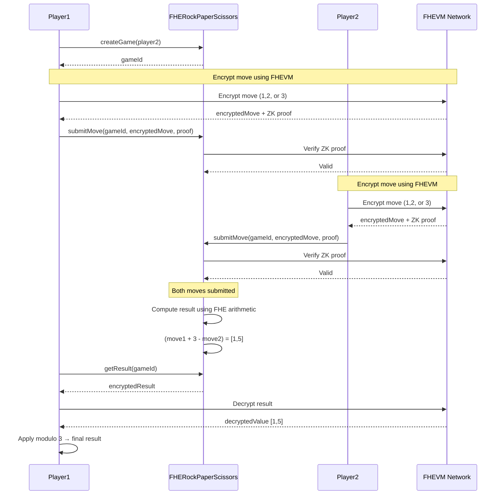

# FHERockPaperScissors - Quickstart Guide

A simple guide for using the Rock-Paper-Scissors game contract.

## Prerequisites

You need:
- Node.js (version 20 or higher)
- npm (version 7 or higher)
- Basic knowledge of how to use command line

## How It Works

### Two-Player Mode

1. Player1 creates a game with Player2
2. Both players encrypt their moves (1=Rock, 2=Paper, 3=Scissors)
3. Players submit their encrypted moves
4. The contract computes the result automatically
5. Players can decrypt and see who won

### Single-Player Mode

1. Player creates a single-player game
2. Player encrypts and submits their move
3. The contract automatically generates a random opponent move using on-chain randomness
4. The result is computed immediately
5. Player can decrypt and see who won

### Game Flow Diagram



### Move Values

| Value | Move     |
| ----- | -------- |
| 1     | Rock     |
| 2     | Paper    |
| 3     | Scissors |

### Result Values

After getting the result:
- `0` = tie
- `1` = Player1 wins
- `2` = Player2 wins

## Quick Start

### 1. Install Dependencies

```bash
npm install
```

### 2. Start Local Node

Open a new terminal and run:

```bash
npx hardhat node
```

Keep this running.

### 3. Deploy Contract

In another terminal:

```bash
npx hardhat --network localhost deploy
```

### 4. Play a Game

**Two-player mode:**
```bash
npx hardhat --network localhost task:game:play --move1 1 --move2 2
```

**Single-player mode:**
```bash
npx hardhat --network localhost task:game:play-single --move 1
```

This creates a game, submits moves, and shows the result. In single-player mode, the opponent's move is generated automatically using on-chain randomness.

## Using the Contract

### Basic Usage

1. Create a game: `createGame(player2Address)`
2. Encrypt your move (1, 2, or 3)
3. Submit the encrypted move: `submitMove(gameId, encryptedMove, proof)`
4. Get the result: `getResult(gameId)` and decrypt it

See the test files for complete examples.

## Contract Functions

### `createGame(player2)`

Creates a new game. Returns a game ID.
- For two-player mode: pass the address of player2
- For single-player mode: pass `address(0)` (zero address)

### `submitMove(gameId, encryptedMove, proof)`

Submits your encrypted move. In single-player mode, the opponent's move is automatically generated and the result is computed immediately. In two-player mode, the result is computed when both players submit.

### `getResult(gameId)`

Gets the encrypted result. You need to decrypt it on the client side.

### `getGameInfo(gameId)`

Shows game status (who submitted, if result is ready, single-player mode, etc.)

## Troubleshooting

**Can't connect to localhost?**
- Make sure you started `npx hardhat node` first

**No deployment found?**
- Run `npx hardhat --network localhost deploy`

**Result not computed?**
- Both players need to submit their moves first
- Check status with: `npx hardhat --network localhost task:game:info --game-id 0`

**Invalid move?**
- Use 1 (Rock), 2 (Paper), or 3 (Scissors)

## Testing

Run tests:
```bash
npm test
```

## Useful Commands

```bash
# Get contract address
npx hardhat --network localhost task:game:address

# Create a two-player game
npx hardhat --network localhost task:game:create --player2 <ADDRESS>

# Create a single-player game
npx hardhat --network localhost task:game:create-single

# Submit a move
npx hardhat --network localhost task:game:submit --game-id 0 --move 1

# Check game status
npx hardhat --network localhost task:game:info --game-id 0

# Get result
npx hardhat --network localhost task:game:result --game-id 0

# Play complete two-player game
npx hardhat --network localhost task:game:play --move1 1 --move2 2

# Play complete single-player game
npx hardhat --network localhost task:game:play-single --move 1
```

